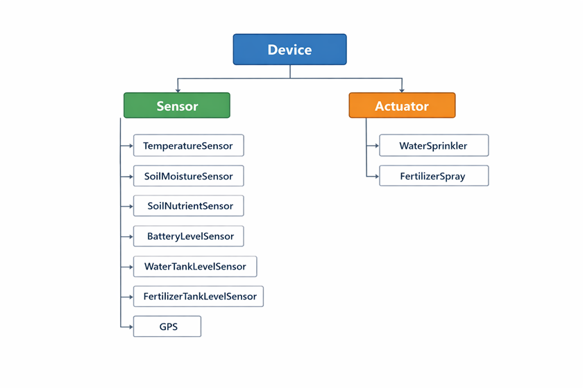
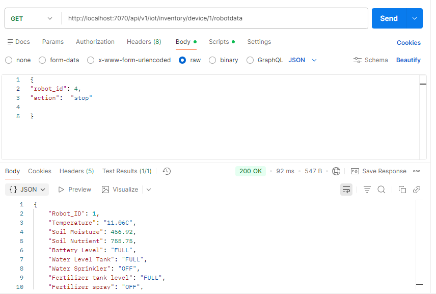
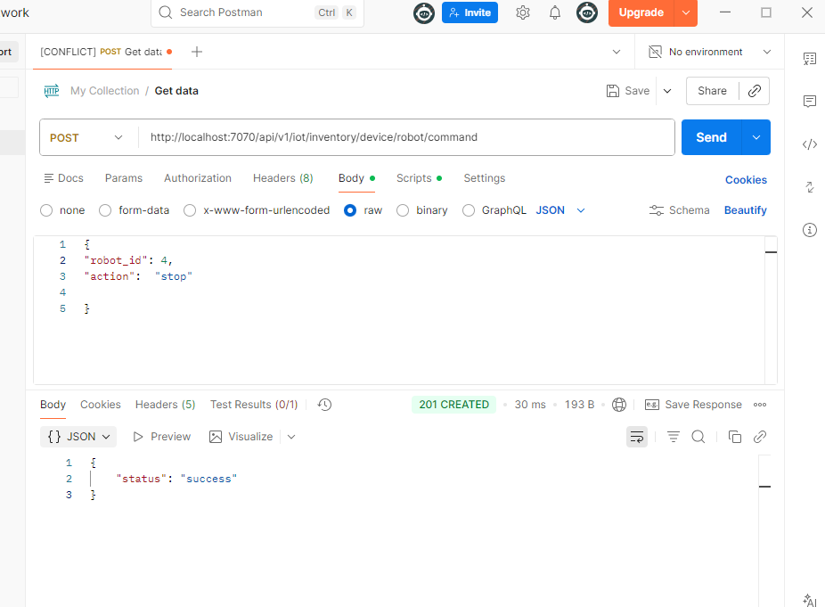

**Title: Smart Agriculture system.**

**Objective:** The objective of this project is to automate daily task performed by farmer through the use of mobile robot. Each mobile robot will comprise of following features;
1.	Mobile robots equipped with sensors and actuators.
2.	Each mobile robot act as a IoT robot, that sends telemetry data and receive user commands over a network.

**Architecture:**
The project has been developed using the distributed software architecture, particularly microservice architecture, where each service has a distinct role and responsibility, thus making a design more modular, scalable and reliable. Each service is deployed using a docker container, thus making a system portable. 
Two protocols are used in the project namely MQTT, a lightweight protocol based on pub/sub model. The protocol is responsible for data transfer between IoT mobile robots, data manager and user service.
Another protocol that has been used is HTTP, which connects user service, Api server and Api user.

 

**Main components:**

**1. Mobile robot:** 
Mobile robot is equipped with sensors and actuator. To model sensor and actuator and embed it into mobile robot object-oriented programming approach has been adapted, which makes the design structured, modular and scalable. 
Using the concept of classes, device class has been created, which serves as parent class for sensors and actuators, then further subclasses of sensors, such as temperature sensor, soil moisture sensor, etc.  and subclasses of actuators, such as water sprinkler, fertilizer spray have been created. Following figure shows the classes and their subclasses.
				

Following table shows the devices used in the design.
 
|**Phenomenon** |	**Type (Sensor/Actuator)**	|   	**Description** |
|-----------|---------------------------|-------------------|
|Temperature   |	Sensor		|	Measure the field temperature (emulated)|
|Soil Moisture |	Sensor		|	Measure soil moisture as robot moves (emulated)|
|Soil nutrient	|       Sensor		|	Measure soil nutrient as robot moves (emulated)|
|Battery level	|       Sensor		|	Measures the battery level of robot (emulated)|
|Water tank level|	Sensor		|	Measure the water tank level of robot (emulated)|
|Fertilizer tank level|	Sensor		|	Measures the fertilizer tank level of robot (emulated)|
|GPS	              | Sensor		|	Location of mobile robot (emulated)|
|Water sprinkler      | Actuator	|	Does the water spray based on soil moisture sensor readings and the threshold value|
|Fertilizer spray     |	Actuator	|	Does the fertilizer spray based on soil nutrient sensor and the threshold value|

Following table shows the sensor models and their description.

|**Sensor Data Model**|	**Initialization attribute**|	**Return value**|
|-----------------|-----------------------------|-------------------|
|Temperature Sensor|	           -	|		Ambient temperature value, unit|
|Soil Moisture Sensor|	           -	|		Value|
|Soil Nutrient Sensor|	           -	|		Value |
|Battery Level	     |             -	|		Level (full, half, low)|
|GPS	             |             -	|		Latitude, longitude, altitude|
|Water Tank Level Sensor|    Tank capacity|	        Level (full, half, low), dead level|
|fertilizer Tank Level Sensor|	Tank capacity|	        Level (full, half, low), dead level|

Water tank level sensor model uses an attribute, **tank capacity** of data type integer. When water sprinkler is activated, the water sprinkler model returns **activation signal**, which is passed as attribute to **read_value method** with in water tank level sensor model.
Fertilizer tank level sensor model uses an attribute, **tank capacity** of data type integer. When fertilizer spray is activated, the fertilizer spray model returns **activation signal**, which is passed as attribute to **read_value method** with in fertilizer tank level sensor model.
Both water & fertilizer tank level sensor models return tank level (full, half, low) based on internal computation and a **dead level = 1**, only when tank level is low.

Following table shows the actuator models and their description.
|Actuator Data Model|	Initialization attribute|	Return value|
|-------------------|---------------------------|-------------------|
|Water sprinkler|	Threshold value| 	        Status (ON/OFF), activation signal|
|Fertilizer spray|	Threshold value|                Status (ON/OFF), activation signal|

Water sprinkler model uses an attribute **threshold** of data type integer, defined at the time of robot initialization. The method named **status** within water sprinkler model uses **value (return by soil moisture sensor)** and **dead level (return by water tank level sensor model)** as an attribute to turn on or off the water sprinkler. If the **value (return by soil moisture sensor)** is greater than **threshold** and **dead level (return by water tank level sensor model)** is equal to 0, only then water sprinkler is turned on, otherwise it is turned off. The **method status** within water sprinkler model is used to monitor the status of water sprinkler.
Fertilizer spray model uses an attribute threshold of data type integer, defined at the time of robot initialization. The method named status within fertilizer spray model uses value (return by soil nutrient sensor) and dead level (return by fertilizer tank level sensor model) as an attribute to turn on or off the water sprinkler. If the value (return by soil nutrient sensor) is greater than threshold and dead level (return by fertilizer tank level sensor model) is equal to 0, only then fertilizer spray is turned on, otherwise it is turned off. The method status within fertilizer spray model is used to monitor the status of fertilizer spray.
Thus, the behavior of both water sprinkler model / water tank level sensor model and fertilizer spray model /fertilizer tank level sensor model is emulated in a **closed loop fashion.**

**Robot Class:**
Robot class is written using the encapsulation and abstraction techniques of object-oriented programming. Thus, robot is initialized with some attributes and all the sensor and actuators are encapsulated within the robot class.
The measurement of sensors and status of actuators are observed through robot status method within the robot class.
Sensors and actuators do not return timestamp with their outputs, this is done deliberately, because all the sensors and actuators are encapsulated in robot class, thus timestamp is returned in the robot status method within robot class.
**Robotstatus method** within the robot class returns the data in JSON format.
Each IoT robot publish telemetry data every 5 seconds
Example of robot initialization:
Robot (robot_id, water_tank_capacity, water_spray_threshold, fertilizer_tank_capacity, fertilizer_spray_threshold, user command)
Each mobile robot is MQTT publisher & subscriber, it publishes data to Data manager & collector and subscribes to user commands via data collector & manager.

**Each mobile robot publishes data on topic:** 
/iot/smart_agriculture/device/<robot.id>/robot

**Each mobile robot is subscribed to topic:**
/iot/smart_agriculture/device/DM1/<robot.id>

**QoS level = 1:** Since we don’t want to miss the data, and the data is less critical and we can afford duplicate messages.

**2. Data Collector & Manager:**
The role of data collector and manager is to receive mobile robot’s telemetry data via MQTT protocol and publish this data for user service.

On the other hand, data collector and manager is subscribed to receive user command via user service, **filters** the user command based on robot id, and publish the user command for mobile robot.

Data collector and manager also saves the data in memory storage. 
To make the service portable, data collector and manager is deployed using **docker container.**

Sharing of data & user command between data collector/ manager, mobile robots and user service is done using MQTT protocol on the following topics:

**Mobile Robot --> Data Collector & Manager:**
**Subscribed topic:**  /iot/smart_agriculture/device/+/robot

**Data Collector & Manager --> Mobile Robot:**
**Published topic:** /iot/smart_agriculture/device/DM1/<robot.id>

**Data Collector & Manager --> User service:**
**Published topic:** /iot/smart_agriculture/device/DM1/data

**User Service --> Data Collector & Manager:**
**Subscribed topic:** /iot/smart_agriculture/device/US/command

**QoS level = 1:** Since we don’t want to miss the data, and the data is less critical and we can afford duplicate messages.

**3.User Service:**
It acts as bridge between data collector /manager and Api server. User service receives robot data from data collector/manager via **MQTT protocol** and expose this data to Api server through **Restful Api**.

On the other hand, user service receives the user command via Api server and publish these commands to data collector and manager via MQTT protocol.

Sharing of data between user command and data collector/manager is done through MQTT protocol on the following topics;

**User Service to Data Collector & Manager:**
**Published topic:** /iot/smart_agriculture/device/US/command

**Data Collector & Manager to User service:**
**Subscribed topic:** /iot/smart_agriculture/device/DM1/data

Sharing of data between user service and Api server is done through HTTP protocol

**User service to Api server:**
http://localhost:7070/api/v1/iot/inventory/device/<robot.id>robotdata

**Api server to User service:**
http://localhost:7070/api/v1/iot/inventory/device/robot/command

JSON data format is used for exchange of mobile robot data and user commands, user service is deployed using docker container, thus making it portable.
**QoS level = 1:** Since we don’t want to miss the data, and the data is less critical and we can afford duplicate messages.

**4.API Server:**
Its serves as main HTTP server implemented through Restful Api.

It uses two resources namely **Robot Data Resource**, used to provide in memory storage and returns, requested robot data to Api user.  Another resource is **Robot Command Resource**, used to provide in memory storage for user commands and returns the user command data to user service. The data format used is JSON.

Api server is implemented using **docker container**, thus making it portable.

**5.POSTMAN**
Api user can connect through POSTMAN; the user can monitor robot data using the **GET method** using the following link
http://localhost:7070/api/v1/iot/inventory/device/1/robotdata

Similarly, user can send command data through **POST method** using the following link.
http://localhost:7070/api/v1/iot/inventory/device/robot/command

 
when sending commands, the data format is JSON and user can perform the following operations;
**1.Start robot operation:**     
{
"robot_id": 1,
"action":  "start"

}

**2.Stop robot operation:**

{
"robot_id": 1,
"action":  "stop"

}

**3.Configure threshold values:**
{
"robot_id": 2,
"action":  "config",
"water_spray_thre" : 200,
"ferti_spray_thre" : 200

}
**6.	MQTT Broker:**
In this project, **Eclipse Mosquito broker** image version 2.0.12 is used, which is officially available on docker hub.

**RUN & TEST SYSTEM**

**1.	IoT Mobile Robot:**
Each mobile robot is a MQTT publisher and subscriber. Robot encapsulate all the sensors and actuators. Robot is initialized using the robot class.

WS_thre = 500
FS_thre = 500
user_command = "stop"

def robot_parameter(WS_thre,FS_thre,user_command):
    # creating a robot
    default_WS_thre = WS_thre
    default_FS_thre = FS_thre
    default_user_command = user_command
    robot = Robot(1,500,default_WS_thre,500,default_FS_thre,default_user_command)
    return robot

robot_1 = robot_parameter(WS_thre,FS_thre,user_command)

for creating robot, a function robot_parameter is defined, that is called later in the code with few parameters. This is done  to the handle the user command, when ever a robot receives user command, the function robot_parameter is called with the user desired value of parameter user_command, thus updating the robot parameters.

In this project four IoT mobile robots have been created, each having individual python file namely, robot_1.py , robot_2.py , robot_3.py , robot_4.py .
To create more IoT robots, more python files, one for each robot will be required.
In python editor, just open the files robot_1.py, robot_2.py, robot_3.py,  robot_4.py  located in iot_robot folder in project directory and run the scripts, the robots will start publishing the telemetry data, and will be ready to receive the user commands.

To run the robot_1.py script following python **libraries** are required;
**paho-mqtt==1.6.1**

**2.	Data Collector & Manager:**
Data collector & manager is located in data_manager folder in project directory. 

Following **libraries** are required to run data_manager.py script;
**paho-mqtt==1.6.1**

After running data_manager.py script, data manager will start receiving robots’ telemetry data, will publish robots, telemetry data for user service, similarly data manager will receive user commands through user service and will publish the command to specific robot based on robot id.
**3.	User service:**
It is located in user service folder in project directory. Run user_service.py, it will start receiving data from data manager and collector, and expose this data to Api server. 
Similarly, user service will receive user command from Api server over HTTP and publish   the user command to data collector and manager.

Following **libraries** are required to run user_server.py;
**paho-mqtt==1.6.1**
**requests==2.31.0**

**4.	Api server & Postman:**
It is located in http-api folder in the project directory. Run api_server.py and in parallel open Postman. To monitor robot telemetry data use, GET method followed by the http link and to send user command use POST method in Postman.

Following **libraries** are required to run api_server.py script.

**Flask~=2.3.2**
**pyyaml~=6.0.1**
**flask_restful~=0.3.10**

**To receive robot data:** http://localhost:7070/api/v1/iot/inventory/device/1/robotdata
Result will be like this:
		

**To send user command: **
http://localhost:7070/api/v1/iot/inventory/device/robot/command
result will be like this:
		
 

**5.	MQTT Broker:**
In this project Eclipse Mosquito broker image version 2.0.12 is used. The image is pull from official docker hub. Docker compose will use mosquitto.config file located in mqtt-broker folder when running the container.

**6.	Docker compose:**
Each service in the project is deployed through docker container. All the docker containers are deployed through docker compose using a single command.

To deploy service using docker container, following operation is performed for each service.
Following is the example of **user service.**
a.	Write a **docker file** and **requirement file**, both files can be written using notepad.
i.	**Requirement.txt**
		paho-mqtt==1.6.1
		requests==2.31.0

ii.	**Docker file**
		FROM python:3.12-slim
		WORKDIR /app
		COPY requirements.txt .
		RUN pip install --no-cache-dir -r requirements.txt
		COPY . .
		CMD ["python", "user_service.py"]

b.	for each service, credentials such as api URL, MQTT credentials are loaded from environment to make the system portable, so that these can be modified in run time. Create .env file where variable of each service is defined. This is a single file located in project root, where variables for each service are defined. This file can be written using notepad.
c.	In the project root, docker-compose.yaml file is written. This file is used by docker compose to build and run all the containers specified in the file.
d.	To run using docker compose, ubuntu WSL is used. In ubuntu terminal change the directory where docker-compose.yaml file is located then run the following command;
 
**docker-compose up –build -d**

**Docker desktop application** can also be used to run and stop the containers, as well as to check the logs of each service deployed using container.

